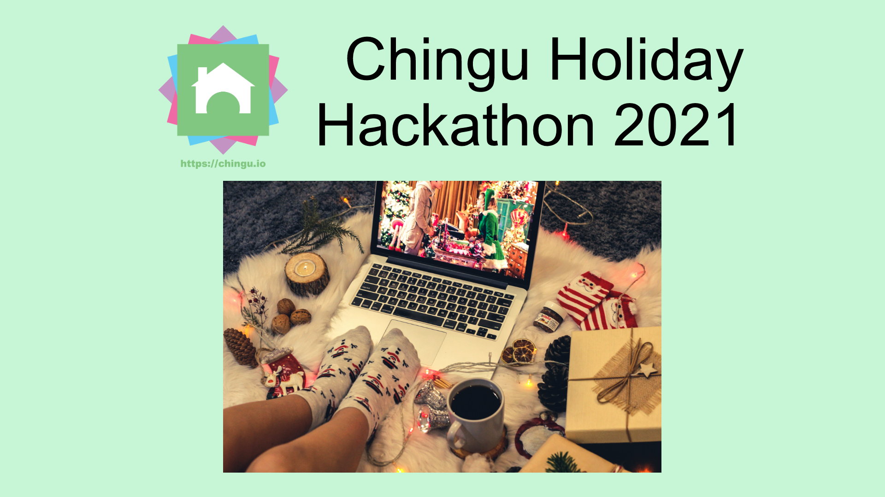

# Chingu Holiday Hackathon 2021

### Contents

[Background](#background) 
 
[Project Requirements](#project-requirements) 
 
[How to Participate](#how-to-participate)
 
[Additional Considerations](#additional-considerations)
 
[Before You Go!](#before-you-go) 

## Background 

The Holiday Season is a time to celebrate with family and friends, a time to reflect on the past year, and a time to relax and have fun.

And for Developers what better way to have fun than by participating in a holiday themed hackathon to both test and extend your skills?

This year [Chingu](https://chingu.io) is sponsoring a Holiday Hackathon so you can do just that! Read on to learn how to enter, compete, and celebrate the Season with a little code!
## Project Description

For the *_Chingu Holiday Hackathon 2021_* you'll be creating a game with a purpose - Help Santa deliver presents around the world before the night is over.

As he travels around the world delivering gifts to all the good Software Developers, households leave either milk & cookies or carrots & tea as snacks for him. Milk & cookies increase Santa's calories and slow him down, while carrots & tea help him control his weight so he can complete deliveries faster.

For the Holiday Hackathon you'll create an app that assigns a 5000 calorie target for Santa and adds 75 calories for milk & cookies and subtracts 50 calories for carrots & tea. 

Santa can visit 10 homes per second as long as his total nightly calorie intake is below 5000, but only 5 homes per second when it greater than or equal to 5000 calories. 

Your app will help Santa monitor his progress by creating a dashboard that's update once per second. This dashboard will display: 

- his nightly calorie target
- his total nightly calories accumulated so far
- the total number of homes who have left him milk & cookies
- the total number of homes who have left him carrots & tea
- his current delivery speed as a number of homes per second
- the number of homes visited so far
- the number of homes remaining.

As you might of guessed, Santa believes you can't manage what you don't measure, so he likes metrics!

You will need to allow Santa to input the total number of homes to be visited before the night is over and `Start` and `Stop` buttons.

At the end of the simulation you'll need to display the total time it took him to complete his deliveries.

## How to Participate

This hackathon will run from **Wednesday, December 1st through Sunday, December 19th**.

You may join as a solo Developer or as a team by signing up [here](https://airtable.com/shrzef3NVWMl9PiKt).

In addition, can use the [GitHub Discussions feature](https://github.com/chingu-hackathons/holidayhackathon2021/discussions) to ask questions, get advice, and compare notes with other participants.

If you don't have access to the Chingu Discord server you can use 

Be sure to [submit your completed project](https://airtable.com/shrtPfnx6eX96AJxt) before the deadline. We will add your project to the new `#showcase` channel in the Chingu Discord server and feature it in our [Twitter](https://twitter.com/ChinguCollabs) and [LinkedIn](https://www.linkedin.com/company/chingu-os) feeds.

We'll also award [Chingu swag](https://chingu.myspreadshop.com/) to the top three projects chosen by a panel of judges. Members of the top three teams will receive a [Chingu water bottle](https://tinyurl.com/yyaub5gh). We'll announce the winners on *_Wednesday, December 22._*

## Additional Considerations

- You may participate as a solo developer or as a team of 2-3 teammates.
- Unleash your imagination and creativity. Create a UI/UX that's distinctive, fun, and appealing.
- You may use any language, framework, or libraries you need.
- Your solution must be your own original work and you may **_not_** use code generators like GitHub Pilot.

## Before You Go

Chingu helps you to get out of “Tutorial Purgatory” by transforming what you’ve learned into experience. 

The experience to boost your Developer career and help you get jobs.
You can learn more about Chingu & how to join us at https://chingu.io